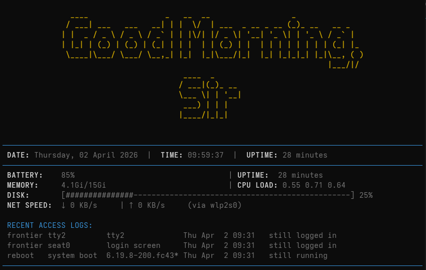

# iitg-DA107-Greetings

A terminal welcome dashboard script that prints a styled greeting and quick system status whenever you open a shell.

## Features

- Time-based greeting banner (morning, afternoon, evening, night)
- Date, time, and uptime summary
- Battery, memory, and CPU load information
- Disk usage bar
- Live network speed snapshot (download/upload)
- Recent login activity (last sessions)

## Screenshot



## Requirements

Install these tools before running the script:

- bash
- zsh (optional, only if you use Zsh)
- figlet
- bc
- iproute2 (for the ip command)
- coreutils, procps, util-linux (usually preinstalled)

### Install dependencies

Ubuntu/Debian:

```bash
sudo apt update
sudo apt install -y figlet bc iproute2
```

Fedora:

```bash
sudo dnf install -y figlet bc iproute
```

Arch Linux:

```bash
sudo pacman -S --needed figlet bc iproute2
```

Optional: install Zsh (only if you plan to use Zsh):

Ubuntu/Debian:

```bash
sudo apt install -y zsh
```

Fedora:

```bash
sudo dnf install -y zsh
```

Arch Linux:

```bash
sudo pacman -S --needed zsh
```

## Quick Start

From the project root:

```bash
chmod +x welcome.sh
./welcome.sh
```

## Run Automatically On New Terminal

Set your project path first (replace with your actual clone location):

```bash
PROJECT_DIR="/path/to/iitg-DA107-Greetings"
```

If you use Bash, append this to your shell startup file:

```bash
echo "cd $PROJECT_DIR && ./welcome.sh" >> ~/.bashrc
```

For Zsh:

```bash
echo "cd $PROJECT_DIR && ./welcome.sh" >> ~/.zshrc
```

**Or, manually edit your shell configuration file:**

To make it run every time you open the terminal, you need to add it to your shell configuration file.

If you use Bash (default): 
```bash
nano ~/.bashrc
```

If you use Zsh (Mac or custom): 
```bash
nano ~/.zshrc
```

Then add this line to the end of the file:
```bash
cd /path/to/iitg-DA107-Greetings && ./welcome.sh
```
(Replace `/path/to/iitg-DA107-Greetings` with your actual project path)

Press `Ctrl+O` to save, then `Ctrl+X` to exit.

Then open a new terminal window.

Note: You only need Bash or Zsh, depending on the shell you actually use. Use an absolute path so it works from any directory.

## Customization

Edit the value of USER_NAME near the top of welcome.sh:

```bash
USER_NAME="Sir"
```

Change it to your preferred name and re-run the script.

## Notes

- Battery shows N/A on systems without /sys/class/power_supply/BAT0.
- Network speed appears only when an active interface is detected.
- Output is designed for Linux terminals.

## Troubleshooting

- figlet: command not found
	Install figlet using your package manager.

- ip: command not found
	Install iproute2 (or iproute on Fedora).

- Permission denied
	Run chmod +x welcome.sh once.